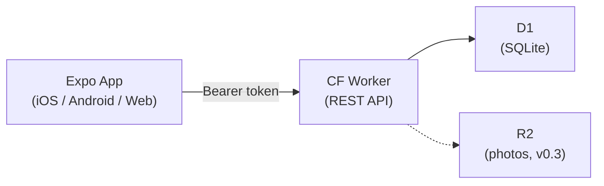

# BabyLog

**家庭宝宝成长记录与分享平台** — 从记录工具起步，成长为家庭记忆平台，最终走向育儿社区。

> Record baby growth, sync across family devices. Dark-themed mobile app with family token auth, multi-baby support, i18n (中文/English), and FaceID/TouchID lock.

## Product Roadmap

| Phase | Version | Focus |
|-------|---------|-------|
| 1 — 记录工具 | **v0.2** (current) | 交互打磨 + 丰富记录类型 + 照片与里程碑 |
| 2 — 家庭记忆平台 | v0.3 | 邀请家庭成员、共享时间线、R2 照片存储 |
| 3 — 育儿社区 | v1.0 | 分享广场、跨家庭经验分享、用户账号体系 |

Core personas: 新手妈妈 (one-tap recording at 3 AM), 新手爸爸 (daily overview & stats), 爷爷奶奶 (view timeline & photos remotely).

## Architecture



- **Mobile** — Expo (React Native) app; dark theme, React Query state, i18n, platform-specific components
- **API** — Cloudflare Worker; manual routing, CORS middleware, SHA-256 token auth
- **DB** — D1 (Serverless SQLite); tables: `families`, `babies`, `events`
- **Auth** — Family token (long-lived secret, stored as SHA-256 hash in D1). Local FaceID/TouchID lock (does not leave device)

## Tech Stack

| Layer | Technology |
|-------|-----------|
| Monorepo | Rush + pnpm |
| Mobile | Expo (React Native) + TypeScript |
| Backend | Cloudflare Workers + TypeScript |
| Database | Cloudflare D1 (SQLite) |
| State | React Query (`@tanstack/react-query`) |
| i18n | `i18next` + `react-i18next` + `expo-localization` |
| Storage (local) | `expo-secure-store` (native) / `localStorage` (web) |
| Image Picker | `expo-image-picker` |
| Theme | Custom dark theme (deep indigo, lavender accents) |
| E2E | Playwright (web) + Maestro (native iOS) |

## Monorepo Structure

```
baby-log/
├── apps/
│   └── mobile/              # Expo app (iOS, Android, Web)
│       ├── src/
│       │   ├── api/         # API client (apiRequest, apiJson)
│       │   ├── components/  # Shared components (Toast, DatePicker, etc.)
│       │   ├── i18n/        # i18next config + locales (zh.json, en.json)
│       │   ├── screens/     # Screen components (Home, QuickAdd, Timeline, Settings, ...)
│       │   ├── store/       # Local persistence (token, settings, profile)
│       │   ├── testids.ts   # Central testID registry
│       │   └── theme.ts     # Design tokens (colors, spacing, borderRadius, shadow)
│       └── e2e/             # Playwright E2E tests
├── services/
│   └── api/                 # Cloudflare Worker API
│       ├── src/
│       │   ├── index.ts     # Main entry (routing, auth middleware, CORS)
│       │   ├── routes/      # Route handlers
│       │   └── db/          # DB query functions
│       └── migrations/      # D1 SQL migrations (001_init, 002_cascade_delete, ...)
├── packages/
│   └── shared-types/        # Shared TypeScript types (Baby, Event, Family)
├── docs/                    # Project documentation (PRD, Architecture, API, E2E, ...)
├── scripts/                 # Helper scripts (E2E, screenshots)
├── todo.md                  # Current iteration task tracker
└── rush.json                # Rush monorepo config
```

## Development

### Prerequisites

- Node.js 18+
- pnpm 9.x
- Rush: `npm install -g @microsoft/rush`
- Cloudflare account (for D1; optional for local-only API)

### Setup

```bash
rush update
```

### API (Cloudflare Workers)

```bash
# Apply DB migrations (first time / after adding new migrations)
cd services/api
npx wrangler d1 migrations apply babylog --local

# Start dev server (http://localhost:8787)
rushx dev
```

See [docs/04-API/](docs/04-API/) for OpenAPI spec and curl examples.

### Mobile (Expo)

```bash
cd apps/mobile

# iOS / Android (Expo Go or Dev Client)
rushx start          # then press i (iOS) or a (Android)

# Web
npx expo start --web --port 19006 --localhost
```

Set `EXPO_PUBLIC_API_URL` if the API is not at `http://localhost:8787` (e.g. your machine IP for physical devices).

### Rush Workflow Tips

```bash
rush update                     # Install / sync all dependencies
rush add -p <package>           # Add dependency to the project in cwd
rush build                      # Build all projects
rushx <script>                  # Run package.json script in cwd project
```

### E2E Testing

Two approaches — see [docs/06-E2E/mobile-e2e.md](docs/06-E2E/mobile-e2e.md) for full setup.

```bash
# Playwright (web, fast, headless, ~18s)
# Requires: API running + Expo Web running on port 19006
cd apps/mobile/e2e && npx playwright test

# Maestro (native iOS simulator, ~2.5min)
# Requires: API running + Expo Dev Client on iOS 18 simulator
maestro test apps/mobile/.maestro/flows/
```

## Key Conventions

These are summarized here; full details in [docs/02-Architecture/overview.md](docs/02-Architecture/overview.md).

| Convention | Rule |
|-----------|------|
| **i18n** | All user-facing text via `t("key")`; locales in `src/i18n/locales/{zh,en}.json` |
| **testID** | All interactive elements must have `testID`; registered in `src/testids.ts` |
| **Platform split** | Cross-platform differences use `.d.ts` / `.web.tsx` / `.native.tsx` (no `Platform.OS` branching) |
| **State** | Remote state via React Query only; local via AsyncStorage / SecureStore |
| **Feedback** | Every mutation needs toast feedback; destructive actions need `Alert.alert` confirmation |
| **Styling** | All styles reference `theme.ts` tokens; use `StyleSheet.create()`; `Pressable` over `TouchableOpacity` |

## Documentation

| # | Folder | Description |
|---|--------|-------------|
| 01 | [01-PRD](docs/01-PRD/PRD.md) | Product requirements: vision, per-version PRDs |
| 02 | [02-Architecture](docs/02-Architecture/overview.md) | Architecture, coding conventions, development rules |
| 03 | [03-Deployment](docs/03-Deployment/deploy.md) | Deployment guide (Cloudflare) |
| 04 | [04-API](docs/04-API/) | API spec (OpenAPI) + curl examples |
| 05 | [05-UI-Style-Guide](docs/05-UI-Style-Guide/index.md) | Mobile UI style guide |
| 06 | [06-E2E](docs/06-E2E/mobile-e2e.md) | E2E testing guide (Playwright + Maestro) |

## Current Iteration

**v0.2** — see [todo.md](todo.md) for the full task tracker.

- Module 1: 交互优化 (1.1–1.7 complete, 1.8 E2E pending)
- Module 2: 丰富记录 (pending)
- Module 3: 照片与里程碑 (pending)

## License

MIT
